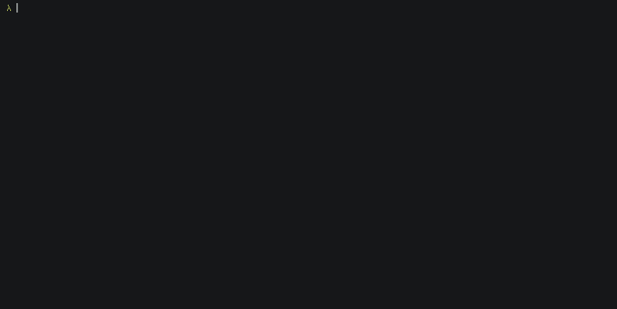

# ncpipes

## Archivation note
This is an old miniproject from 2023. Look at remake (rxpipes)[https://github.com/inunix3/rxpipes] which is cooler.

## Original README

  

## Building
To build this project, you should install the [notcurses](https://github.com/dankamongmen/notcurses) library.

If you have notcurses installed, just type `mkdir build && cd build && cmake ..`. You can also install `ncpipes` by typing `sudo cmake --install .`

## Usage
Type `ncpipes` and the pipes will start running on your screen! To exit, press Ctrl-C.

But, there are a few options that you can pass to `ncpipes`. To see what options are available, type `ncpipes -h`. For example, you can change the frame rate, what colors use, the turning probability, etc.
